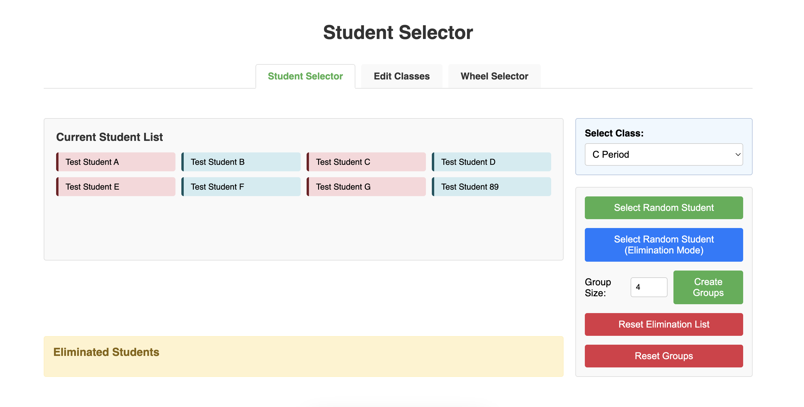
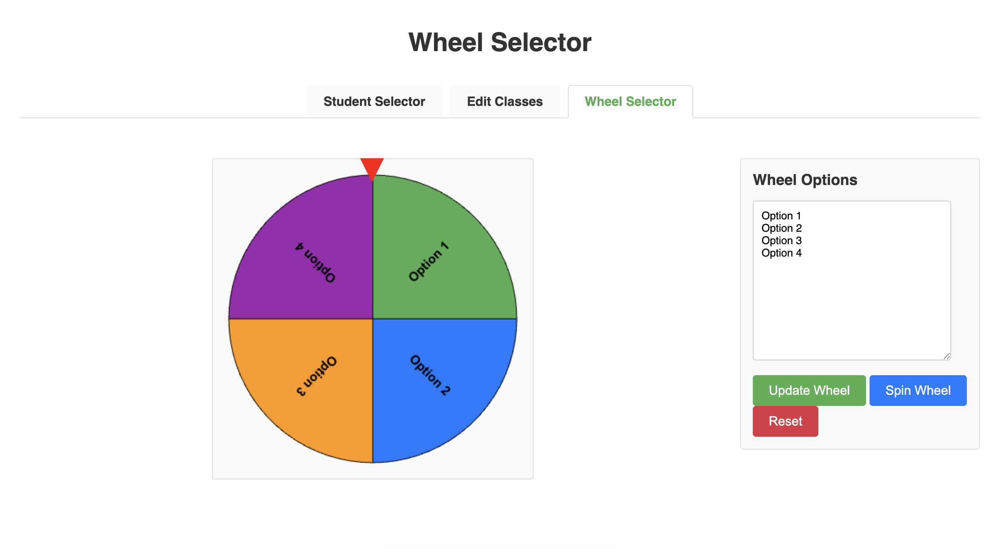

# Student Selector

A simple web application for randomly selecting students in a classroom setting.

## Overview

Student Selector is a tool designed to help teachers randomly choose students for classroom participation, group assignments, or other educational activities. This application streamlines the selection process, ensuring fair and unbiased student participation.



## Features

- **Random Student Selection**: Quickly select students at random
- **Interactive Selection Wheel**: Visually engaging spinning wheel powered by Winwheel.js
- **Customizable Wheel Options**: Modify the appearance and behavior of the selection wheel (Using Winwheel.js)
- **Class Management**: Create and edit class lists
- **User-Friendly Interface**: Simple, intuitive design for easy classroom use
- **Customizable Options**: Adapt the tool to fit your specific classroom needs



## Browser Compatibility

This application works best in Chrome, Safari, and Edge browsers. Some features may not work properly in Firefox-based browsers.

## Installation

No installation required! This is a web-based application that runs directly in your browser.

Visit the live version at: https://flowersjus.github.io/student_selector

To use locally:

1. Clone the repository
```bash
git clone https://github.com/flowersjus/student_selector.git
```

2. Open `index.html` in your web browser

## Usage

1. Navigate to the main page
2. Add your class roster using the edit functionality
3. Configure the selection wheel with your preferred options
4. Click the Select Random Student button to randomly select a student
5. Navigate to the Wheel Selector page
6. Edit the options, each option on a new line
7. The wheel will animate and stop on a randomly selected option

## Technologies Used

- HTML
- CSS
- JavaScript (72.2%)
- Winwheel.js for the interactive selection wheel

## Contributing

Contributions are welcome! If you'd like to improve Student Selector:

1. Fork the repository
2. Create your feature branch
3. Commit your changes
4. Push to the branch
5. Open a pull request

## Future Enhancements

- Export/import functionality
- Additional randomization options
- UI wheel customization features
- Improved Firefox browser compatibility

## License

This project is open source and available for educational use.

## Acknowledgments

- [Winwheel.js](https://github.com/zarocknz/javascript-winwheel) by Douglas McKechie for the spinning wheel functionality

Best wishes,
Justin Flowers
