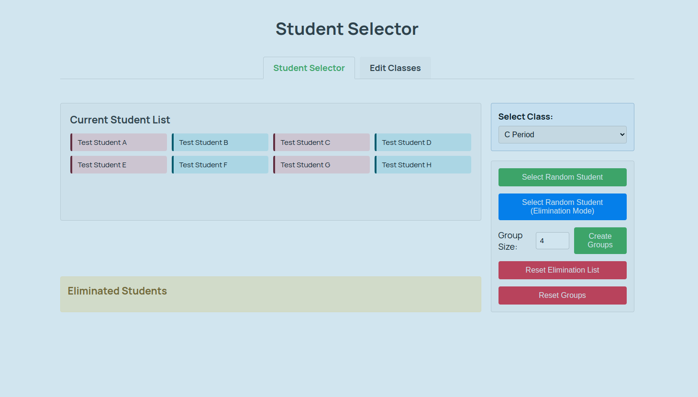

# Student Selector

A simple web application for randomly selecting students in a classroom setting.

## Overview

<div style="text-align:center">
  
</div>

Student Selector is a tool designed to help teachers randomly choose students for classroom participation, group assignments, or other educational activities. This application streamlines the selection process, ensuring fair and unbiased student participation.

## Features

- **Random Student Selection**: Quickly select students at random
- **Class Management**: Create and edit class lists
- **User-Friendly Interface**: Simple, intuitive design for easy classroom use
- **Customizable Options**: Adapt the tool to fit your specific classroom needs


## Installation

No installation required! This is a web-based application that runs directly in your browser.

To use locally:

1. Clone the repository
```bash
git clone https://github.com/flowersjus/student_selector.git
```

2. Open `index.html` in your web browser

## Usage

1. Navigate to the main page
2. Add your class roster using the edit functionality
3. Click the selection button to randomly choose a student
4. Use additional features as needed for your classroom activities

## Technologies Used

- HTML
- CSS
- JavaScript (72.2%)


## Contributing

Contributions are welcome! If you'd like to improve Student Selector:

## Future Enhancements

- Save multiple class rosters
- Selection history tracking
- Additional randomization options


## License

This project is open source and available for educational use.
